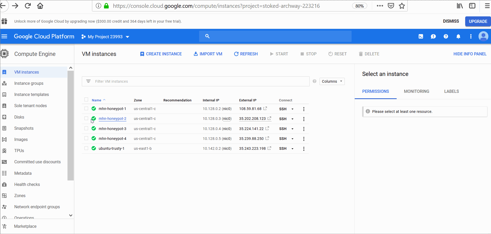
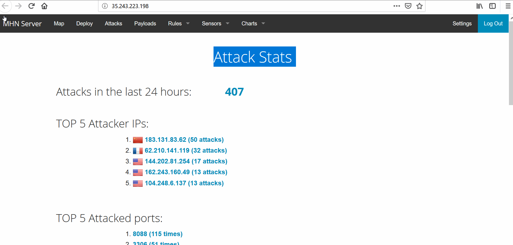
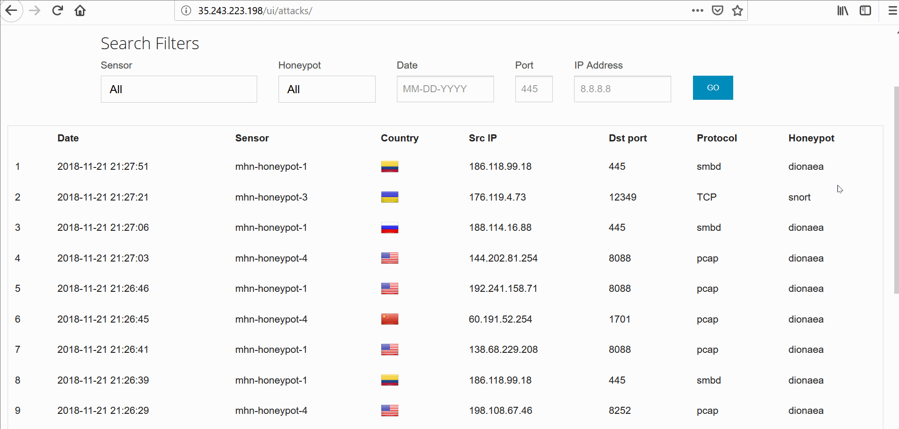
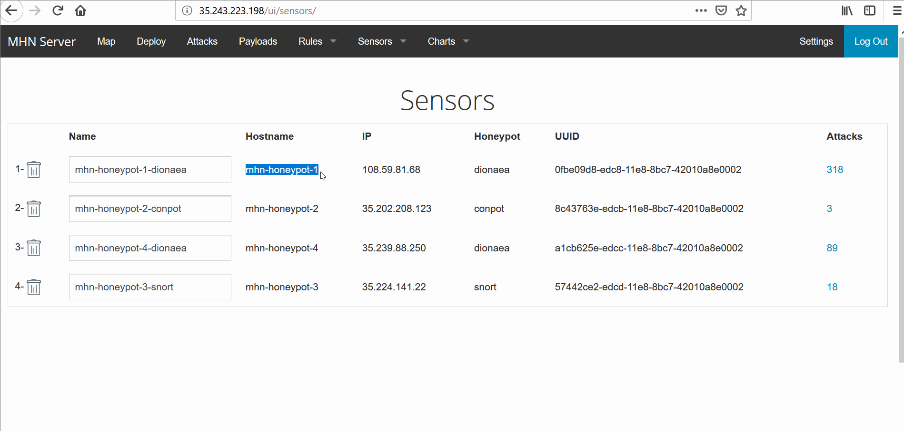

# Web-Security-Week9

# Project 9 - Honeypot

Time spent: **22** hours spent in total

> Objective: Learn about Network Security by attacking and being attacked at vulnarable networked resources. Multiple Honey Pot VM instances were created to demonstrate it. 

## Which HoneyPot(s) you deployed 
  - mhn-honeypot-1 : dionaea
  - mhn-honeypot-2 : conpot
  - mhn-honeypot-3 : snort
  - mhn-honeypot-4 : dionaea

## Any issues you encountered
  > My biggest issue was getting access to the ip web app that MHN sets up for you. I had to spend several days to find another way to do it. 

## A summary of the data collected: number of attacks, number of malware samples, etc.
1. The setup of GoogleCloud and Honeypots.
    - I used Google Cloud to set up a VM using Ubuntu Trusty 14.04 . I cloned a git repository and installed MHN. This VM will be the Admin while the other 4 VM will be the Honeypots to attack.
    - I created 2 dionaea Honeypots, 1 snort Honeypot, and 1 conpot Honeypot.
    
    - GIF of all of my Honeypots: 
      
      
2. GIF demonstating all of my attacks
    - : GIF of the Attack Stats
      
    - GIF of the Attacks Report:
       
      
3. GIF of the Sensors deployed: 
    
  
## Any unresolved questions raised by the data collected 
  > None.

## Resources

GIFs created with [LiceCap](http://www.cockos.com/licecap/).

## License

    Copyright [2018] [Evan Vasquez]

    Licensed under the Apache License, Version 2.0 (the "License");
    you may not use this file except in compliance with the License.
    You may obtain a copy of the License at

        http://www.apache.org/licenses/LICENSE-2.0

    Unless required by applicable law or agreed to in writing, software
    distributed under the License is distributed on an "AS IS" BASIS,
    WITHOUT WARRANTIES OR CONDITIONS OF ANY KIND, either express or implied.
    See the License for the specific language governing permissions and
    limitations under the License.
